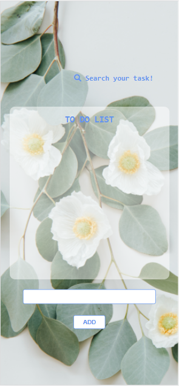
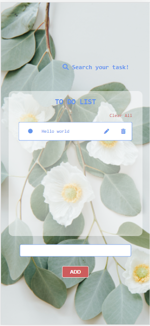
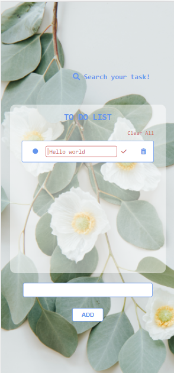
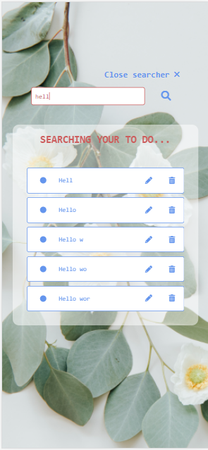
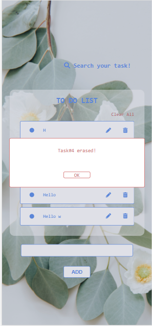

# To Do App ✔
This app allows the users to save their pending tasks and edit them so they can define wether if the task is done or not, change its value and erase them if they want so.

## 🔗 Link
Click to the button below to open its GitHub pages' link:

[)](https://afonttorres.github.io/to-do-app/)

## Tech Stack

This app was developed with HTML5, CSS3 and EC6 (Vanilla JS).

## Features

- Responsive design for all devices
- Autocomplete searcher

## Screenshots

## Authors
+ [@afonttorres](https://github.com/afonttorres)

#### Contact me:

[Email](mailto:afonttorres@gmail.com)

 
